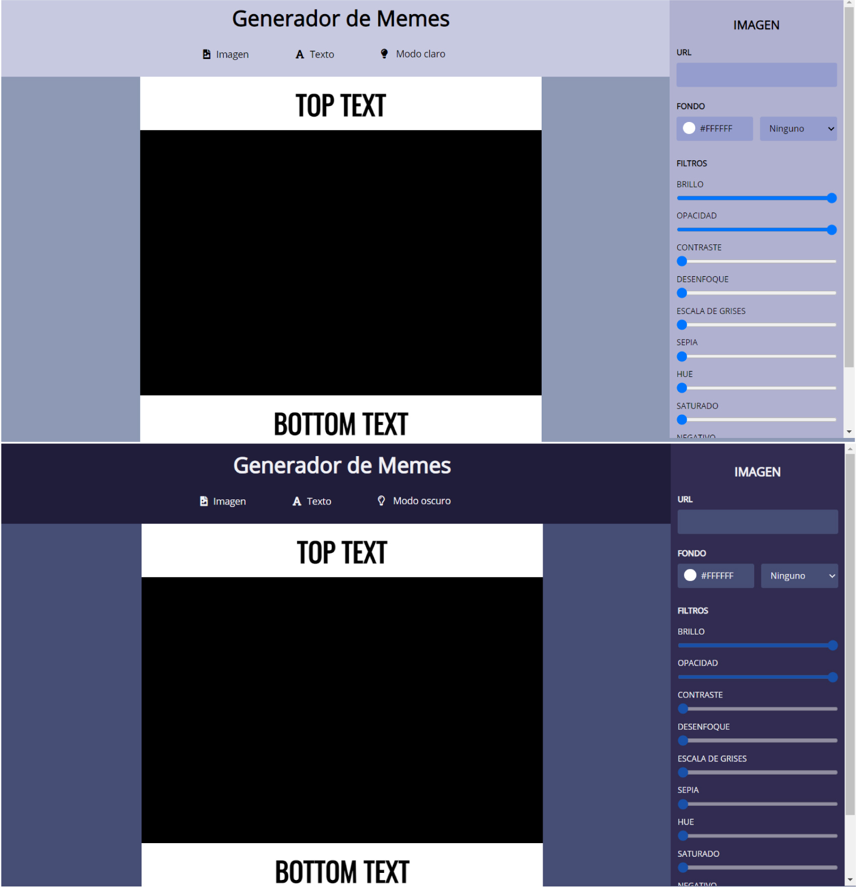
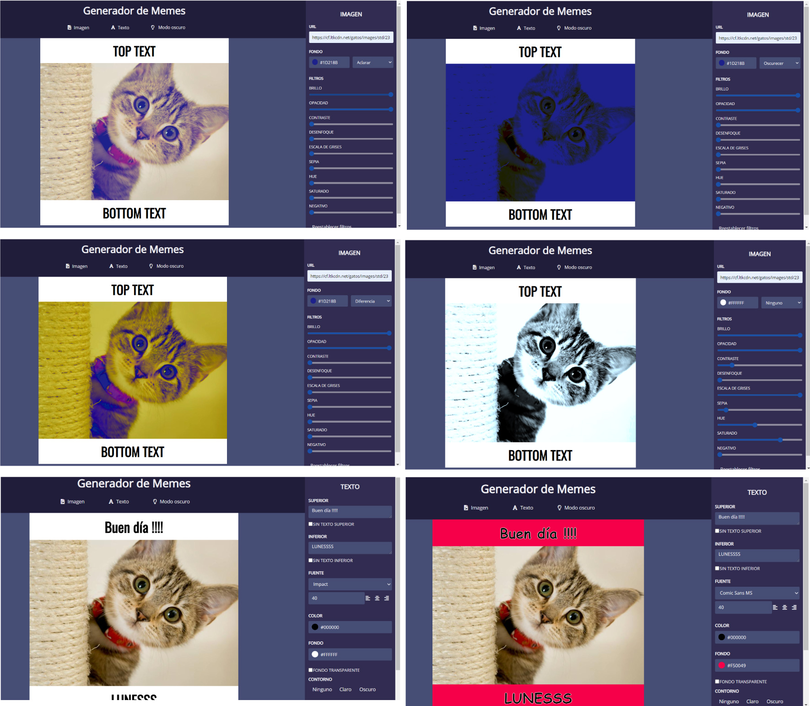

# Editor de Memes

### Este proyecto , el primero de muchos con JavaScript, es el desarrollo de un Generador de Memes 💻

### Si ingresas en este [enlace](https://pame-85.github.io/Generador-de-memes/) vas a poder ver como funciona.

*** 
### Algunas de sus funciones son Modo claro y Oscuro 

### Contiene filtros de imágen y Texto 

***

#### Quiero agradecer ♥ a quienes hicieron posible esto , a los profesores y mis compañeras resolviendo dudas 💬

